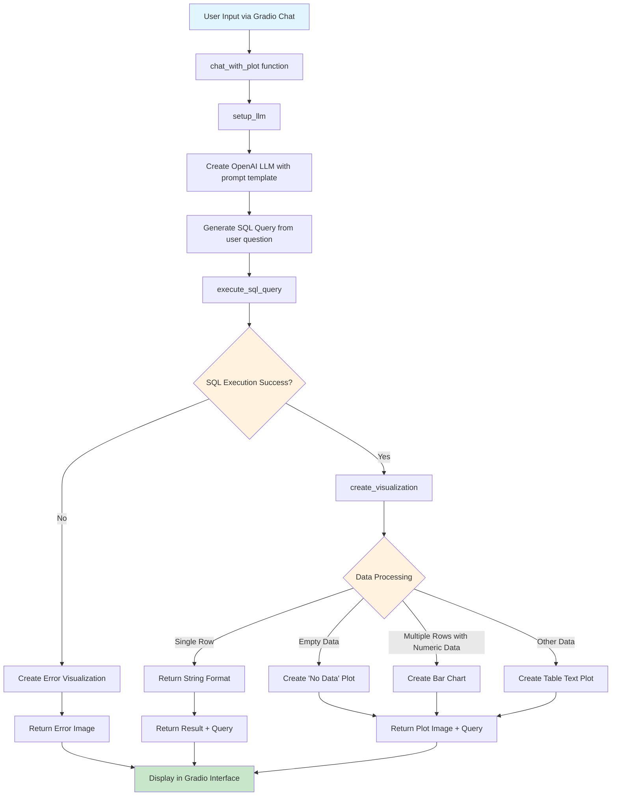
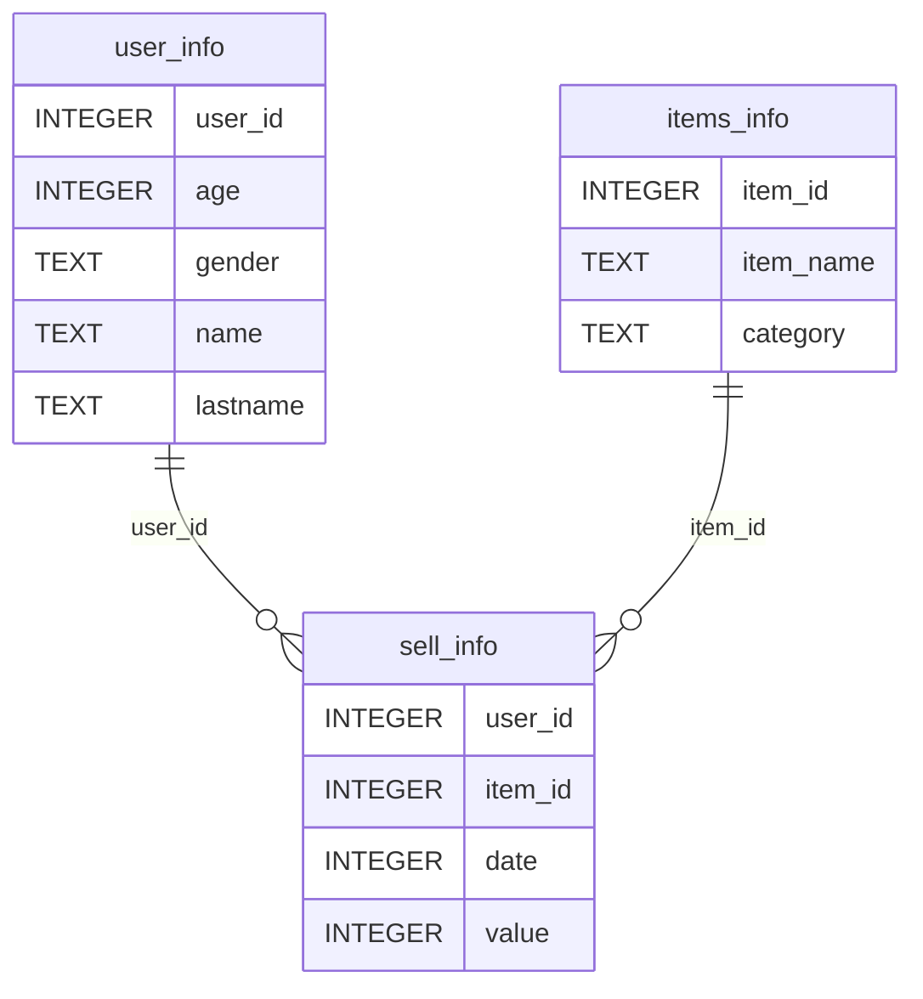
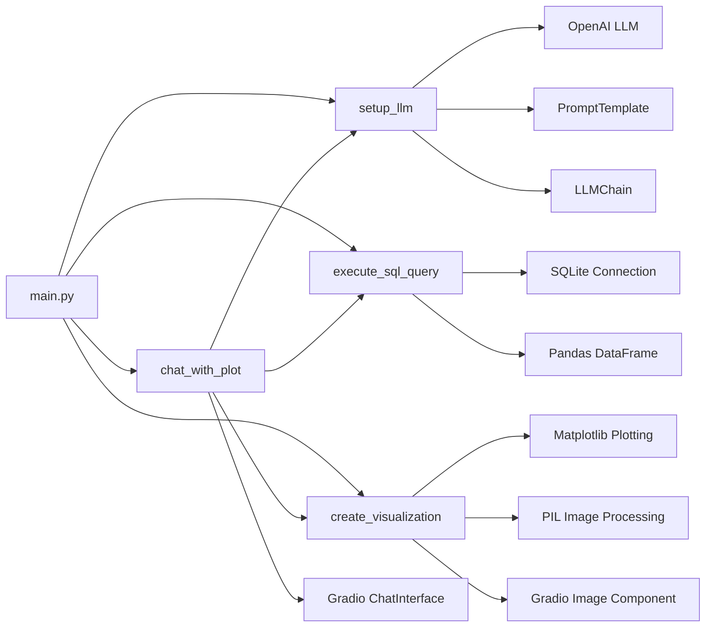

# Simple Response Application

This application creates a Gradio chat interface that converts natural language questions into SQL queries and visualizes the results.

## Application Flow

## Database Schema

## Function Dependencies

