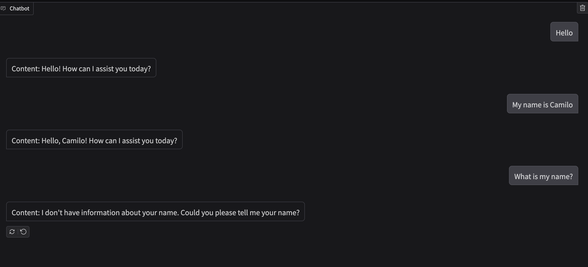

# And here?

1) Here we are going to create an actual agent that can do tool calling
2) The current implementation doesn't have memory, as you can see in the next image

3) Here we have a sinc and async response availables, you can them exchanging "chat" with "chat_async" in  "gradio_interface.py" 