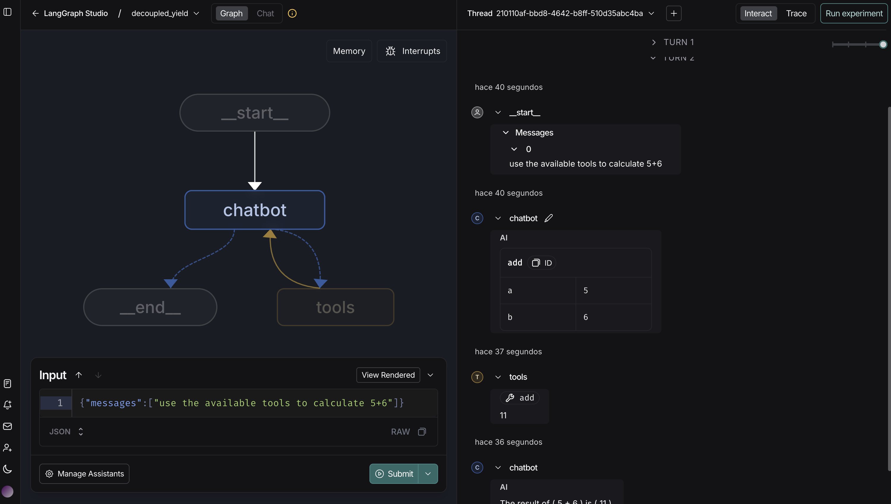

# And here?

Here instead of using the built in function create_react_agent, we are going to compile the react agent by ourselves

There are three different implementations of the react_agent

1) 01_agent_simple_decoupled.py
2) 01_agent_simple.py
3) decoupled_yield.py

where each one varies the way the agent connect to the MCP server, it is worth to check the differences betwheen each one

We can check the  graph execution using LangGraph Studio, for do that I need to execute in the current folder
* uv run langgraph dev

