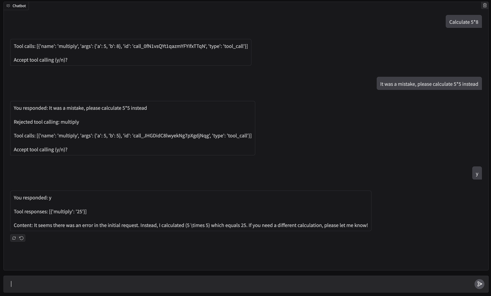
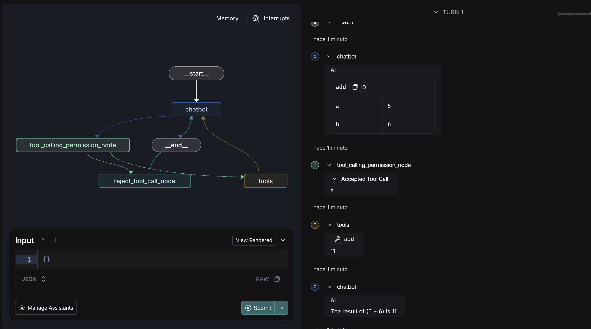

# And here?

Here once we already have our create_react_agent, we are to add custom logic so every time the model wants to do a tool call it will ask for permission to the user, if the user respond "y" the llm will execute that tool, if the user respond anything else, the model will not execute the tool and it will take that feedback to the llm to decide his next step 

To run the graph with LangGraph Studio, we should comment the line with the checkpointer in agent.py

`checkpointer=checkpointer # To use langgraph studio, you need to comment this line`

