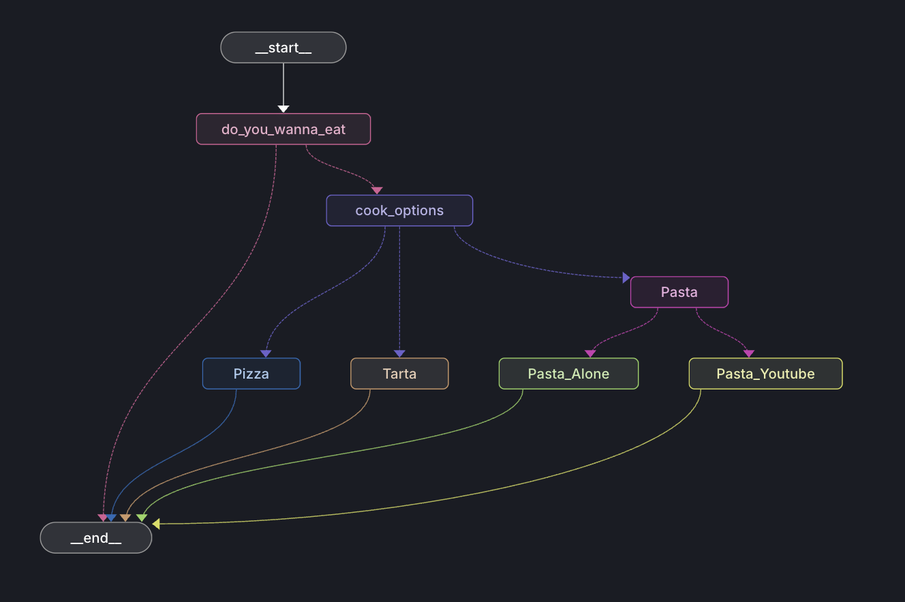

# And here?

Here we have an agent that stops in multiple nodes, asks feedback and moves to another nodes based on that feedback

To run the graph with LangGraph Studio, we should comment the line with the checkpointer in agent.py

`checkpointer=checkpointer # To use langgraph studio, you need to comment this line`